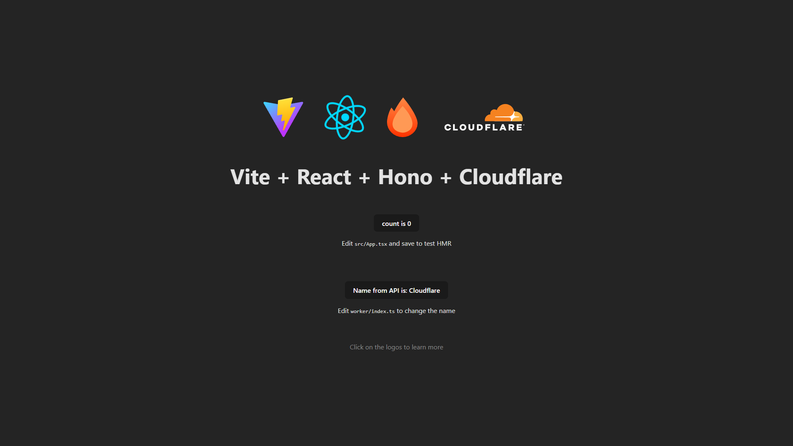

<div align="center">

# BHVR Template (Bun Hono Vite React)

[](https://deploy.workers.cloudflare.com/?url=https://github.com/ZulfiFazhar/bhvr-template)




</div>

This project is a **BHVR Template**, a powerful and modern starter kit combining **Bun**, **Hono**, **Vite**, and **React**. It is designed to provide a lightning-fast development experience and high-performance production builds, optimized for Cloudflare Workers.

## Project Structure

Here's an overview of the project's file structure:

```
bhvr-template/
├── public/                  # Public static assets
├── src/
│   ├── client/              # React frontend application (Vite + React Router)
│   │   ├── assets/          # Images, icons, SVGs
│   │   ├── pages/           # Page components (user/, etc.)
│   │   ├── routes/          # React Router configuration
│   │   ├── services/        # API service layers
│   │   ├── App.tsx          # Main landing page component
│   │   ├── main.tsx         # React + Router entry point
│   │   └── index.css        # Global styles (Tailwind CSS)
│   └── server/              # Cloudflare Worker (Hono backend)
│       ├── controllers/     # Request handlers (userController.ts)
│       ├── repositories/    # Data access layer (userRepository.ts)
│       ├── routes/          # Route definitions (userRoute.ts)
│       ├── services/        # Business logic (userService.ts)
│       └── index.ts         # Worker entry point
├── .gitignore               # Git ignore rules
├── bun.lock                 # Bun lockfile
├── package.json             # Project dependencies and scripts
├── tsconfig.json            # TypeScript project references
├── tsconfig.app.json        # Frontend TypeScript config
├── tsconfig.worker.json     # Backend TypeScript config
├── vite.config.ts           # Vite configuration
└── wrangler.json            # Cloudflare Workers configuration
```

## Tech Stack Deep Dive

This template leverages a cutting-edge stack to ensure maximum performance and developer productivity:

- **[Bun](https://bun.sh/)**: A fast all-in-one JavaScript runtime, bundler, and package manager. It replaces Node.js and npm, offering significantly faster install times and script execution.
- **[Hono](https://hono.dev/)**: An ultrafast web framework specifically designed for Edge environments like Cloudflare Workers. It handles routing and API logic with minimal overhead.
- **[Vite](https://vitejs.dev/)**: Next Generation Frontend Tooling. It provides an instant dev server with Hot Module Replacement (HMR) and optimized production builds.
- **[React](https://react.dev/)**: The industry-standard library for building interactive user interfaces.
- **[React Router](https://reactrouter.com/)**: Declarative client-side routing for React applications.
- **[Tailwind CSS](https://tailwindcss.com/)**: Utility-first CSS framework for rapid UI development.
- **[Cloudflare Workers](https://workers.cloudflare.com/)**: A serverless execution environment that runs your code on Cloudflare's global network, ensuring low latency for users worldwide.

## Configuration

### `wrangler.json`

This file configures your Cloudflare Worker.

- **`main`**: Points to `./src/server/index.ts` (Hono backend entry point)
- **`compatibility_flags`**: Set to `["nodejs_compat"]` to enable Node.js compatibility APIs in the runtime
- **`observability`**: Enabled by default to provide logs and metrics
- **`assets`**: Configures the worker to serve static assets from `./dist/client` with SPA fallback routing

### `vite.config.ts`

Vite is configured with:

- `@cloudflare/vite-plugin` for seamless Cloudflare Workers integration
- `@tailwindcss/vite` for Tailwind CSS v4 support
- Path aliases (`@client/*`, `@server/*`) for clean imports

### TypeScript Configuration

The project uses **TypeScript project references** for strict separation:

- `tsconfig.app.json` - Frontend config (DOM types, React)
- `tsconfig.worker.json` - Backend config (Node.js, Cloudflare types)
- `tsconfig.node.json` - Build tools config

## Getting Started

Follow these steps to get your project up and running using `bun`.

### Prerequisites

Make sure you have [Bun](https://bun.sh/) installed on your machine.

```bash
curl -fsSL https://bun.sh/install | bash
```

### Installation

1.  **Clone the repository**

    ```bash
    git clone https://github.com/ZulfiFazhar/bhvr-template.git
    cd bhvr-template
    ```

2.  **Install dependencies**

    ```bash
    bun install
    ```

### Development

Start the development server with hot reloading:

```bash
bun run dev
```

- **Frontend**: [http://localhost:5173](http://localhost:5173)
- **Backend (Worker)**: The worker logic is integrated into the dev server.

### Production

Build the application for production:

```bash
bun run build
```

This command compiles both the React application (via Vite) and the Worker code (via `tsc`).

### Deployment

Deploy your application to Cloudflare Workers:

```bash
bun run deploy
```

This will upload your worker and static assets to Cloudflare.

### Preview

Preview the production build locally before deploying:

```bash
bun run preview
```

## Scripts

- `dev`: Starts the local development server with HMR
- `build`: Builds the project for production (TypeScript check + Vite build)
- `deploy`: Builds and deploys the project to Cloudflare Workers
- `preview`: Builds the project and starts a local preview server
- `lint`: Runs ESLint to check for code quality issues
- `check`: Runs a full check (type check, build, and dry-run deploy)
- `cf-typegen`: Generates TypeScript types from `wrangler.json` bindings

## Architecture Highlights

### Frontend (React + Vite)

- **React Router v7** for declarative client-side routing
- **Tailwind CSS v4** with Vite plugin for styling
- **Service layer pattern** for API communication
- Path aliases (`@client/*`) for clean imports

### Backend (Hono + Cloudflare Workers)

- **N-Layered architecture** with clear separation of concerns:
  - **Routes**: Define endpoints and HTTP methods
  - **Controllers**: Handle requests and responses
  - **Services**: Contain business logic
  - **Repositories**: Manage data persistence
- Path aliases (`@server/*`) for clean imports
- Node.js compatibility enabled for broader API support

### Example: User Feature

The template includes a complete CRUD implementation for user management:

- Frontend: `src/client/pages/user/`, `src/client/services/userService.tsx`
- Backend: `src/server/routes/userRoute.ts` → `controllers/userController.ts` → `services/userService.ts` → `repositories/userRepository.ts`

This demonstrates the recommended pattern for adding new features to your application.
